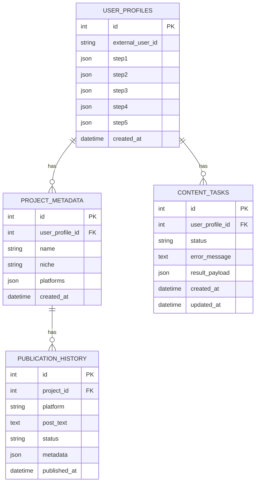
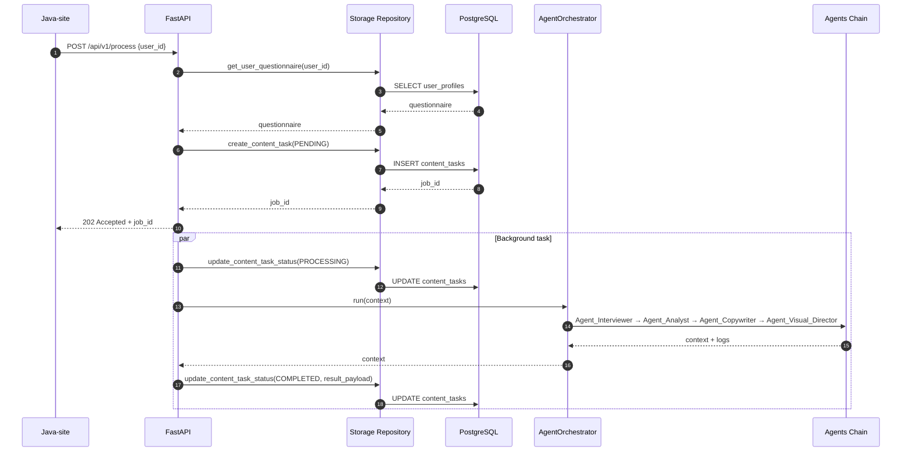
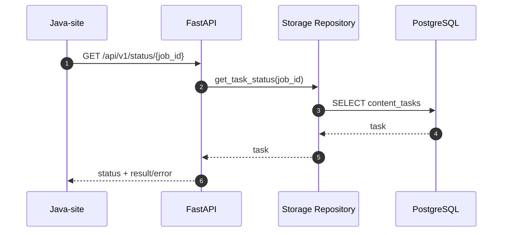
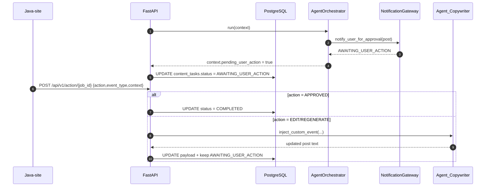

# Отчет по связям и интеграциям «UCust.AI»

Дата: 2026-02-10

## 1. Общая схема взаимодействий

- API слой (`bridge/api_controller.py`) принимает запросы от внешнего Java‑сайта и запускает цепочку агентов в фоне.
- Оркестратор (`core/orchestrator.py`) запускает агентов по очереди и собирает технический лог.
- Агенты (`core/agents.py`) используют:
  - SQL‑хранилище (PostgreSQL через SQLAlchemy) для анкеты пользователя и задач.
  - Модули парсинга (заглушки Telethon/VK).
  - Лингвистический фильтр (заглушка RoSBERTa).
  - Нейросетевой генеративный модуль (заглушка Saiga).
  - Векторное хранилище эмбеддингов (заглушка ChromaDB/FAISS) для контроля дублей.
- Java‑bridge (`bridge/java_bridge.py`) предоставляет контракты для интеграции с внешним Java‑backend.

## 2. API слой (FastAPI)

Файл: `bridge/api_controller.py`

### POST /api/v1/process (дублируется как /process)

- Вход: `user_id`
- Действия:
  1. Загружает анкету пользователя из SQL через `storage/repository.py:get_user_questionnaire`.
  2. Если анкета не найдена → 404.
  3. Создает задачу в SQL через `storage/repository.py:create_content_task` со статусом `PENDING`.
  4. Запускает фоновую задачу `BackgroundTasks`.
- Выход: `job_id`, статус `accepted`.

### GET /api/v1/status/{job_id}

- Вход: `job_id`
- Действия:
  1. Получает запись задачи через `storage/repository.py:get_task_status`.
  2. Если задача не найдена → 404.
  3. Возвращает статус `PENDING/PROCESSING/COMPLETED/FAILED`.
  4. При `COMPLETED` возвращает результат (`post_text` или `image_link` из `result_payload`).
  5. При `FAILED` возвращает краткое `error`.

## 3. Оркестратор и агенты

Файлы: `core/orchestrator.py`, `core/agents.py`

- `build_default_orchestrator()` собирает цепочку:
  1. `Agent_Interviewer`
  2. `Agent_Analyst`
  3. `Agent_Copywriter`
  4. `Agent_Visual_Director`

### Agent_Interviewer
- Валидирует анкету и сохраняет в SQL (`UserProfile`).

### Agent_Analyst
- Забирает данные из `TelethonCollector` и `VkApiCollector`.
- Пропускает текст через `PreProcessor`.
- Формирует SWOT и стратегию через `GenerativeCore`.

### Agent_Copywriter
- Генерирует черновик поста и проверяет дубли через `InMemoryVectorStore`.
- Поддерживает `inject_custom_event(event_type, context, source_text)` для ручного вброса событий:
  - `gratitude`
  - `achievement`
  - `emergency`
  - `custom_edit`

### Agent_Visual_Director
- Формирует сетку контента и промпты для Kandinsky.

### Notification + User Intercept
- Новый модуль: `core/notifier.py`.
- `AgentOrchestrator` после генерации контента отправляет callback через `NotificationGateway`.
- При ответе `AWAITING_USER_ACTION` оркестратор переводит задачу в точку перехвата:
  - состояние `Ожидание решения пользователя`
  - статус задачи в SQL: `AWAITING_USER_ACTION`
- После `APPROVED` задача переводится в `COMPLETED`.

## 4. SQL‑хранилище (PostgreSQL)

Файлы: `storage/db.py`, `storage/models.py`, `storage/repository.py`

### Таблицы
- `user_profiles` — анкета пользователя (шаги 1–5).
- `project_metadata` — метаданные проекта.
- `publication_history` — история публикаций.
- `content_tasks` — задачи генерации контента (статусы и ошибки).

### Репозиторий
- `get_user_questionnaire()` — загрузка анкеты по `user_id`.
- `create_content_task()` — создание задачи.
- `update_content_task_status()` — обновление статуса + error/result.
- `get_task_status()` — получение статуса задачи.

## 5. Векторное хранилище эмбеддингов

Файл: `storage/vector_store.py`

- Интерфейс `VectorStore` и реализация `InMemoryVectorStore`.
- Используется `Agent_Copywriter` для проверки уникальности контента.

## 6. Логирование

Файл: `bridge/api_controller.py`

- Стандартный `logging` пишет в `app_log.log`.
- Логи включают:
  - Запуск агентов
  - Технические логи цепочки
  - Traceback при критических ошибках

## 7. Интеграция с Java‑backend

Файл: `bridge/java_bridge.py`

- Заглушки отправки анкеты, черновика поста и промпта Kandinsky.
- Контракты соответствуют Pydantic‑моделям из `schemas/models.py`.

## 8. Ключевые контракты

Файл: `schemas/models.py`

- Анкета пользователя (5 шагов)
- Метаданные проекта
- История публикаций
- SWOT и стратегия
- Черновик поста
- План сетки и промпты для Kandinsky

---

## 9. Mermaid-диаграммы

### 9.1. ER‑диаграмма SQL‑схемы

### 9.2. Последовательность запуска обработки (POST /api/v1/process)

### 9.3. Проверка статуса (GET /api/v1/status/{job_id})

### 9.4. User Intercept + Event Injection

